# sysmon-splunk-lateral-movement-detections

Sysmon + Splunk Lateral Movement Detection Lab
Overview

This project demonstrates end-to-end Windows attack detection using Sysmon telemetry, Splunk ingestion, and Sigma detection rules. Multiple attacker techniques were simulated and validated against live logs to confirm reliable detection coverage.

Architecture

Windows VM (attacker + victim simulation)

Sysmon (custom XML configuration)

Splunk Enterprise (local ingestion)

Sigma rules for detection logic

Telemetry Collection (Sysmon)

Sysmon was installed with a custom configuration to capture high-value security events:

Process creation (Event ID 1)

Network connections (Event ID 3)

File creation (Event ID 11)

Registry persistence (Event IDs 12–14)

Process termination (Event ID 5)

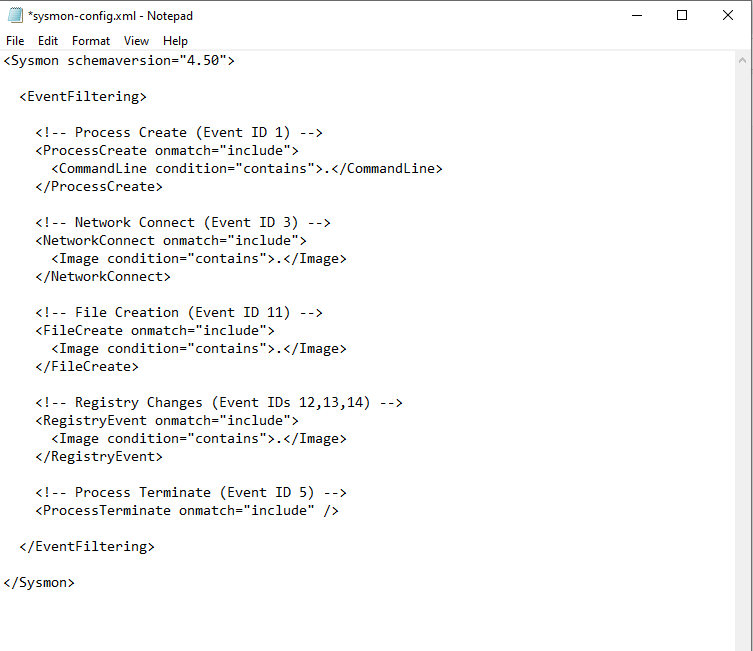
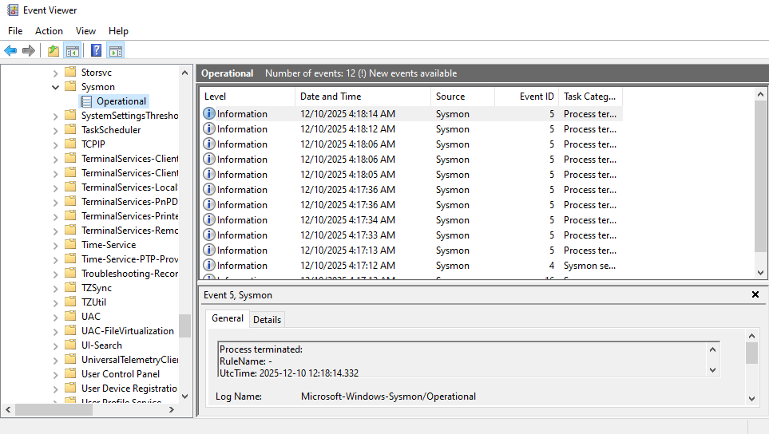

Splunk Ingestion & Parsing

Windows Sysmon Operational logs were ingested directly into Splunk using inputs.conf.
Custom field extraction was applied to reliably parse Event IDs from XML logs.

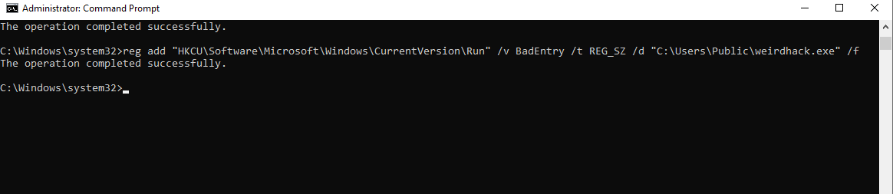
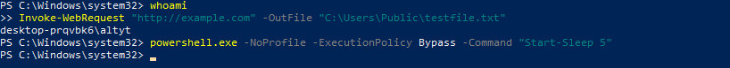
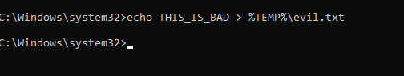
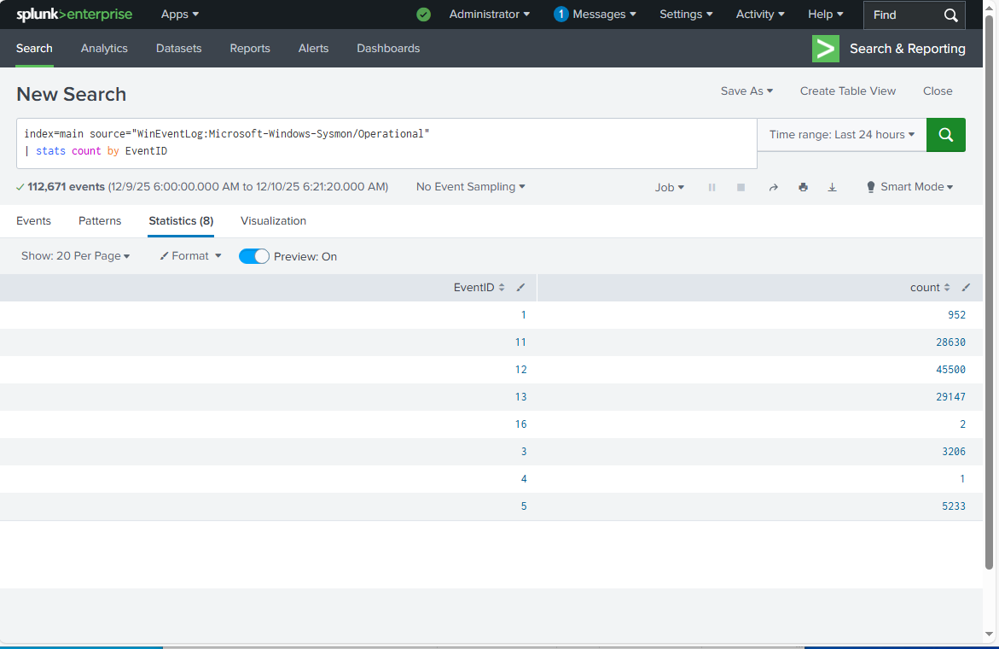

Attack Simulation & Validation

The following attacker behaviors were executed and confirmed in Splunk:

1. Execution from User Temp Directory

Dropped and executed weirdhack.exe from %TEMP%

Detected via Sysmon Event ID 1

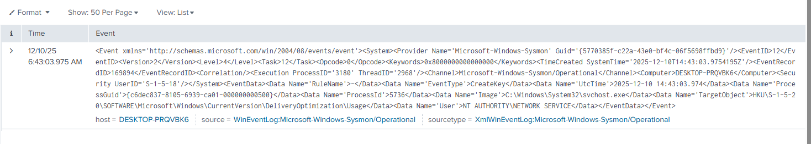

2. Registry Run Key Persistence

Added persistence via HKCU\Software\Microsoft\Windows\CurrentVersion\Run

Detected via Sysmon Event IDs 12–14

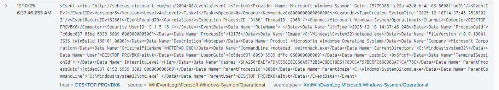

3. Local Admin Account Creation

Created a local user and added to Administrators group using net user

Detected via Sysmon Event ID 1 (command-line analysis)

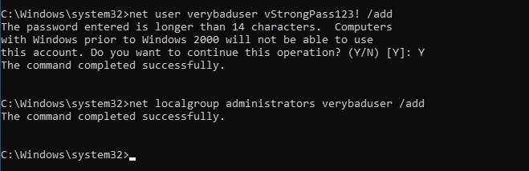

4. Suspicious File Creation

Created evil.txt in Temp directory

Detected via Sysmon Event ID 11

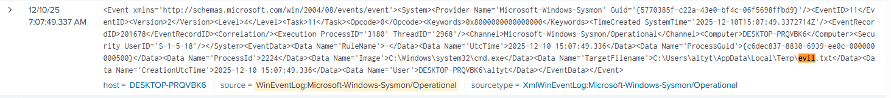

Sigma Detection Rules

Custom Sigma rules were authored to detect each technique and mapped to MITRE ATT&CK:

exe_from_temp.yml → Execution

registry_run_persistence.yml → Persistence

local_admin_net_user.yml → Privilege escalation / persistence

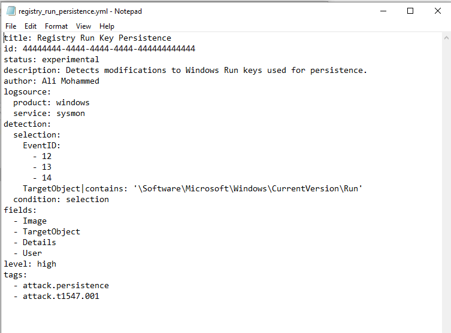

Key Skills Demonstrated

Windows telemetry engineering

Sysmon configuration and tuning

Splunk ingestion and field extraction

ATT&CK-aligned detection logic

Sigma rule authoring and validation

Hands-on adversary simulation
